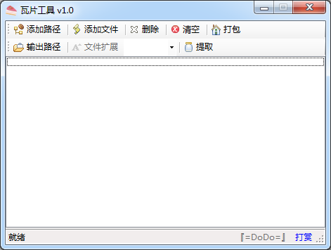

### MBTile瓦片打包和提取工具 ###

### 瓦片打包 ###

> 1. 可以将碎瓦片打包到 MBTile 数据文件中
> 2. 碎瓦片可以是 JPG PNG 等栅格切片，也可以是 PBF JSon 等矢量切片，也可以是 terrain 等三维DEM数据
> 3. 碎瓦片满足标准的 WEB 墨卡托切片规范
> 4. 碎瓦片需要按照  {zoom}/{row}/{col}.{extname} 的目录进行组织

### 瓦片提取 ###

> 1. 首先设置提取后文件的扩展名
> 2. 然后设置提取后文件的存放路径
> 3. 提取后的瓦片文件会按照 {zoom}/{row}/{col}.{extname} 的目录进行组织

**关键字**

瓦片 矢量瓦片 打包 提取 Tile MBTile SQLite  
